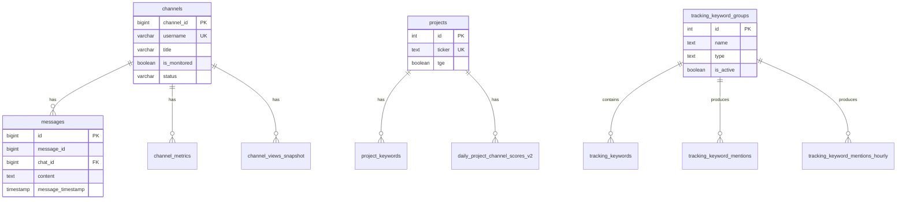

# KOL DB 스키마 레퍼런스

> Claude Code context document. KOL DB(PostgreSQL) 전체 스키마. DB 컬럼 확인을 위해 직접 쿼리하지 않아도 됨.

> 최종 업데이트: 2026-02-19 (05 데이터베이스 스키마.md 통합 완료)

---

## 목차

1. [crypto_market](#1-crypto_market)
2. [telegram](#2-telegram)
3. [search_analytics](#3-search_analytics)
4. [youtube](#4-youtube)
5. [news_scraper](#5-news_scraper)
6. [kol](#6-kol)
7. [storyteller](#7-storyteller)
8. [public](#8-public)
9. [Enum 타입](#9-enum-타입)
10. [주의사항 / 참고노트](#10-주의사항--참고노트)
11. [Data Update Schedule](#11-data-update-schedule)
12. [ER Diagram](#12-er-diagram)
13. [Access Control](#13-access-control)
14. [Common Queries](#14-common-queries)

---

## 1. crypto_market

### 1.1 cmc_exchange_market_pairs (파티션 테이블)

> CMC 거래소 마켓 페어 데이터. 월별 파티션 (`cmc_exchange_market_pairs_y{YYYY}m{MM}`)

| 컬럼 | 타입 | Nullable | 비고 |
|------|------|----------|------|
| id | integer | NO | PK, auto-increment |
| exchange_id | integer | NO | 거래소 ID |
| rank | integer | YES | |
| market_id | integer | YES | |
| market_pair | character varying | NO | 예: BTC/USDT |
| category | character varying | YES | |
| market_url | text | YES | |
| currency_id | integer | NO | |
| price | numeric | YES | |
| volume_usd | numeric | YES | USD 거래량 |
| effective_liquidity | numeric | YES | |
| quote | numeric | YES | |
| volume_base | text | YES | |
| volume_quote | text | YES | |
| fee_type | character varying | YES | |
| depth_usd_negative_two | numeric | YES | -2% 호가 깊이 |
| depth_usd_positive_two | numeric | YES | +2% 호가 깊이 |
| volume_percent | numeric | YES | |
| is_verified | boolean | YES | default: false |
| type | character varying | YES | |
| last_updated | timestamp with time zone | NO | |
| created_at | timestamp with time zone | YES | default: CURRENT_TIMESTAMP |
| cmc_exchange_id | integer | YES | CMC 거래소 ID |
| cmc_currency_id | integer | YES | CMC 통화 ID |

**인덱스:** `cmc_emp_unique_key`, `cmc_exchange_market_pairs_partitioned_pkey`

---

### 1.2 currencies

> 암호화폐 통화 마스터 테이블

| 컬럼 | 타입 | Nullable | 비고 |
|------|------|----------|------|
| id | integer | NO | PK, auto-increment |
| symbol | character varying | NO | 예: BTC |
| name | character varying | YES | 예: Bitcoin |
| slug | character varying | YES | |
| created_at | timestamp with time zone | YES | default: CURRENT_TIMESTAMP |
| updated_at | timestamp with time zone | YES | default: CURRENT_TIMESTAMP |

**인덱스:** `currencies_pkey`, `currencies_symbol_name_key`

---

### 1.3 exchanges

> 거래소 마스터 테이블

| 컬럼 | 타입 | Nullable | 비고 |
|------|------|----------|------|
| id | integer | NO | PK, auto-increment |
| name | character varying | NO | |
| slug | character varying | NO | |
| created_at | timestamp with time zone | YES | default: CURRENT_TIMESTAMP |
| updated_at | timestamp with time zone | YES | default: CURRENT_TIMESTAMP |

**인덱스:** `exchanges_pkey`, `exchanges_name_slug_key`

---

### 1.4 partition_size_log

> 파티션 크기 모니터링 로그

| 컬럼 | 타입 | Nullable | 비고 |
|------|------|----------|------|
| log_date | timestamp with time zone | YES | default: now() |
| partition_name | text | YES | |
| row_count | bigint | YES | |
| total_size_bytes | bigint | YES | |
| table_size_bytes | bigint | YES | |
| index_size_bytes | bigint | YES | |

---

### 1.5 Materialized Views (crypto_market)

다음 매터리얼라이즈드 뷰가 존재함 (countMap/indexMap에서 확인):

- **mv_exchange_currency_volume** -- 인덱스: `idx_mv_exchange_currency_volume_currency`, `idx_mv_exchange_currency_volume_date`, `idx_mv_exchange_currency_volume_exchange`, `idx_mv_exchange_currency_volume_unique`
- **mv_exchange_currency_volume_90_days** -- 인덱스: `idx_mv_exchange_currency_volume_90_days_unique`
- **mv_exchange_daily_volume** -- 인덱스: `idx_mv_exchange_daily_volume_currency`, `idx_mv_exchange_daily_volume_date`, `idx_mv_exchange_daily_volume_exchange`, `idx_mv_exchange_daily_volume_unique`
- **mv_exchange_daily_volume_90_days** -- 인덱스: `idx_mv_exchange_daily_volume_90_days_unique`
- **mv_market_depth_analysis_90_days** -- 인덱스: `idx_mv_market_depth_analysis_90_days_exchange`, `idx_mv_market_depth_analysis_90_days_symbol`, `idx_mv_market_depth_analysis_90_days_unique`
- **mv_market_pairs_volume_90_days** -- 인덱스: `idx_mv_market_pairs_volume_90_days_exchange`, `idx_mv_market_pairs_volume_90_days_pair`, `idx_mv_market_pairs_volume_90_days_unique`, `idx_mv_market_pairs_volume_90_days_volume`

---

## 2. telegram

### 2.1 channels

> 텔레그램 채널/그룹 마스터 테이블

| 컬럼 | 타입 | Nullable | 비고 |
|------|------|----------|------|
| channel_id | bigint | NO | PK |
| username | character varying | YES | 텔레그램 username |
| title | character varying | YES | 채널명 |
| access_hash | bigint | YES | Telethon access hash |
| category | character varying | YES | 카테고리 |
| is_monitored | boolean | YES | default: false, 모니터링 대상 여부 |
| status | character varying | YES | default: 'active' |
| created_at | timestamp without time zone | NO | default: CURRENT_TIMESTAMP |
| updated_at | timestamp without time zone | NO | default: CURRENT_TIMESTAMP |
| memo | character varying | YES | |
| is_channel | boolean | NO | default: false, 채널(true) vs 그룹(false) |
| latest_message_id | bigint | YES | |
| forum | boolean | YES | 포럼 타입 여부 |
| profile_image_url | text | YES | |
| manual_tier | character varying | YES | 수동 설정 티어 |
| subscriber_count | integer | YES | default: 0 |
| owner_telegram_id | bigint | YES | 채널 소유자 텔레그램 ID |
| owner_username | character varying | YES | 채널 소유자 username |
| verified_at | timestamp without time zone | YES | |

**인덱스:** `channels_pkey`, `channels_username_key`, `idx_channels_category`, `idx_channels_channel_id`, `idx_channels_monitored`, `idx_channels_owner_telegram_id`, `idx_channels_username`

---

### 2.2 messages (파티션 테이블)

> 텔레그램 메시지. 월별 파티션 (`messages_y{YYYY}m{MM}`), **chat_id 기준 파티션**

| 컬럼 | 타입 | Nullable | 비고 |
|------|------|----------|------|
| id | bigint | NO | PK |
| message_id | bigint | NO | 텔레그램 메시지 ID |
| chat_id | bigint | NO | 채팅방 ID (파티션 키) |
| sender_id | jsonb | YES | 발신자 정보 (JSON) |
| content | text | YES | 메시지 내용 |
| entities | jsonb | YES | 텔레그램 엔티티 (링크, 멘션 등) |
| views_count | integer | YES | default: 0 |
| forwards_count | integer | YES | default: 0 |
| reactions | jsonb | YES | 리액션 데이터 |
| message_timestamp | timestamp without time zone | NO | 메시지 발송 시각 |
| created_at | timestamp with time zone | NO | |
| is_channel_msg | boolean | YES | 채널 메시지 여부 |
| content_tsv | tsvector | YES | 전문검색용 tsvector |
| updated_at | timestamp with time zone | NO | |
| topic_id | bigint | YES | 포럼 토픽 ID |
| fwd | jsonb | YES | 포워딩 원본 정보 (JSON) |
| fwd_peer_id | bigint | YES | 포워딩 원본 peer ID |
| fwd_peer_type | USER-DEFINED (peer_type) | YES | 포워딩 원본 타입 (user/chat/channel) |
| fwd_message_id | bigint | YES | 포워딩 원본 메시지 ID |
| fwd_date | timestamp with time zone | YES | 포워딩 원본 날짜 |
| quote | jsonb | YES | 인용 데이터 |

**인덱스:** `messages_partitioned_pkey`, `messages_partitioned_chat_id_message_id_timestamp_unique`, `idx_messages_fwd_peer`, `idx_messages_part_chat_timestamp`, `idx_messages_part_content_tsv`, `idx_messages_ts_brin`

---

### 2.3 messages_old

> 마이그레이션 이전 메시지 백업 테이블 (레거시)

| 컬럼 | 타입 | Nullable | 비고 |
|------|------|----------|------|
| id | bigint | NO | PK |
| message_id | bigint | NO | |
| chat_id | bigint | NO | |
| sender_id | jsonb | YES | |
| content | text | YES | |
| entities | jsonb | YES | |
| views_count | integer | YES | default: 0 |
| forwards_count | integer | YES | default: 0 |
| reactions | jsonb | YES | |
| message_timestamp | timestamp without time zone | NO | |
| created_at | timestamp without time zone | NO | default: CURRENT_TIMESTAMP |
| is_channel_msg | boolean | YES | |

**인덱스:** `messages_pkey`, `messages_chat_id_message_id_unique`, `idx_messages_chat_timestamp`, `idx_messages_sender`

---

### 2.4 channel_discussion_mapping

> 방송채널 <-> 연결된 채팅방(그룹) 매핑. 자동 포워딩 필터에 사용.

| 컬럼 | 타입 | Nullable | 비고 |
|------|------|----------|------|
| channel_id | bigint | NO | PK, 방송채널 ID |
| groupchat_id | bigint | NO | 연결된 채팅방 ID |
| created_at | timestamp without time zone | NO | default: CURRENT_TIMESTAMP |
| updated_at | timestamp without time zone | NO | default: CURRENT_TIMESTAMP |

**인덱스:** `channel_discussion_mapping_pkey`, `unique_groupchat`

---

### 2.5 channel_metrics

> 채널 메트릭 (구독자수, 메시지수, 조회수 중앙값 등)

| 컬럼 | 타입 | Nullable | 비고 |
|------|------|----------|------|
| id | bigint | NO | PK |
| channel_id | bigint | NO | |
| participants_count | bigint | YES | 참여자 수 |
| messages_count | bigint | YES | 메시지 수 |
| created_at | timestamp with time zone | NO | default: now() AT TIME ZONE 'utc' |
| median_views | double precision | YES | 조회수 중앙값 |
| median_forwards | double precision | YES | 포워드 중앙값 |
| stats_date | date | YES | 통계 날짜 |
| updated_at | timestamp with time zone | YES | default: now() |

**인덱스:** `channel_metrics_pkey`, `idx_channel_metrics_channel_id_created_at`, `idx_channel_metrics_channel_id_stats_date`

---

### 2.6 channel_participants

> 채널 참여자 수 히스토리

| 컬럼 | 타입 | Nullable | 비고 |
|------|------|----------|------|
| id | bigint | NO | PK, auto-increment |
| channel_id | bigint | NO | |
| count | integer | NO | 참여자 수 |
| created_at | timestamp without time zone | NO | default: CURRENT_TIMESTAMP |

**인덱스:** `channel_participants_pkey`, `idx_channel_participants_created_at`

---

### 2.7 channel_score_adjustments

> 채널 점수 수동 보정 (프로젝트별)

| 컬럼 | 타입 | Nullable | 비고 |
|------|------|----------|------|
| project_id | integer | NO | PK 일부 |
| channel_id | bigint | NO | PK 일부 |
| delta | numeric | NO | 점수 보정값 |
| reason | text | YES | 보정 사유 |
| effective_date | date | NO | default: CURRENT_DATE |
| expiry_date | date | YES | 만료일 |
| created_at | timestamp with time zone | YES | default: now() |
| updated_at | timestamp with time zone | YES | default: now() |

**인덱스:** `channel_score_adjustments_pkey`

---

### 2.8 channel_views_snapshot

> 채널 조회수 스냅샷

| 컬럼 | 타입 | Nullable | 비고 |
|------|------|----------|------|
| id | bigint | NO | PK, auto-increment |
| channel_id | bigint | NO | |
| snapshot_time | timestamp with time zone | NO | |
| total_channel_views | bigint | YES | default: 0 |
| total_channel_forwards | bigint | YES | default: 0 |
| message_count | integer | YES | default: 0 |
| avg_views | double precision | YES | |
| max_views | integer | YES | |
| min_views | integer | YES | |
| top_performing_message_id | bigint | YES | |
| metadata | jsonb | YES | |
| created_at | timestamp with time zone | YES | default: now() |

**인덱스:** `channel_views_snapshot_pkey`, `idx_channel_views_snapshot_channel`, `idx_channel_views_snapshot_time`, `unique_channel_snapshot`

---

### 2.9 message_embeddings

> 메시지 임베딩 벡터

| 컬럼 | 타입 | Nullable | 비고 |
|------|------|----------|------|
| internal_message_id | bigint | NO | PK |
| channel_id | bigint | NO | |
| message_id | bigint | NO | |
| message_timestamp | timestamp without time zone | NO | |
| model | text | NO | 임베딩 모델명 |
| version | integer | NO | 모델 버전 |
| dim | integer | NO | 벡터 차원 |
| embedding | USER-DEFINED (vector) | NO | pgvector |
| created_at | timestamp with time zone | YES | default: now() |
| updated_at | timestamp with time zone | YES | default: now() |

**인덱스:** `message_embeddings_pkey`, `idx_embeddings_lookup`, `me_small_v1_hnsw`, `message_embeddings_channel_id_idx`, `message_embeddings_message_timestamp_idx`, `message_embeddings_model_version_idx`

---

### 2.10 message_metrics

> 메시지 메트릭 히스토리 (조회수/포워드/리액션 추적)

| 컬럼 | 타입 | Nullable | 비고 |
|------|------|----------|------|
| id | bigint | NO | PK, auto-increment |
| message_id | bigint | NO | |
| views_count | integer | YES | default: 0 |
| forwards_count | integer | YES | default: 0 |
| reactions | jsonb | YES | |
| recorded_at | timestamp without time zone | NO | 기록 시점 |
| created_at | timestamp without time zone | NO | default: CURRENT_TIMESTAMP |

**인덱스:** `message_metrics_pkey`, `idx_message_metrics_message`

---

### 2.11 message_views_snapshot

> 개별 메시지 조회수 스냅샷

| 컬럼 | 타입 | Nullable | 비고 |
|------|------|----------|------|
| id | bigint | NO | PK, auto-increment |
| channel_id | bigint | NO | |
| message_id | bigint | NO | |
| snapshot_time | timestamp with time zone | NO | |
| views_count | integer | YES | default: 0 |
| forwards_count | integer | YES | default: 0 |
| reactions_data | jsonb | YES | |
| content_preview | text | YES | |
| created_at | timestamp with time zone | YES | default: now() |

**인덱스:** `message_views_log_pkey`, `idx_message_views_snapshot_channel`, `idx_message_views_snapshot_message`, `unique_message_snapshot`

---

### 2.12 projects

> 추적 프로젝트 (티커 단위)

| 컬럼 | 타입 | Nullable | 비고 |
|------|------|----------|------|
| id | integer | NO | PK, auto-increment |
| ticker | text | NO | 예: BTC, ETH |
| tge | boolean | YES | default: false, TGE 완료 여부 |
| created_at | timestamp without time zone | YES | default: CURRENT_TIMESTAMP |
| updated_at | timestamp without time zone | YES | default: CURRENT_TIMESTAMP |
| logo | text | YES | 로고 URL |

**인덱스:** `projects_pkey`, `projects_ticker_key`

---

### 2.13 project_keywords

> 프로젝트별 추적 키워드

| 컬럼 | 타입 | Nullable | 비고 |
|------|------|----------|------|
| project_id | integer | NO | |
| keyword | text | NO | |
| created_at | timestamp without time zone | YES | default: CURRENT_TIMESTAMP |
| updated_at | timestamp with time zone | NO | default: now() AT TIME ZONE 'utc' |
| id | integer | NO | PK |
| is_active | boolean | YES | ⚠️ 스키마 문서에만 기재, **실제 DB 컬럼 미존재 확인됨** (2026-02-13) |

**인덱스:** `project_keywords_pkey`, `uq_project_keyword`

---

### 2.14 daily_keyword_stats

> 일별 키워드 멘션 통계 (채널 구분 없음)

| 컬럼 | 타입 | Nullable | 비고 |
|------|------|----------|------|
| ticker | text | NO | PK 일부 |
| keyword | text | NO | PK 일부 |
| mention_count | integer | NO | |
| stats_date | date | NO | PK 일부 |
| created_at | timestamp with time zone | NO | default: now() AT TIME ZONE 'utc' |
| updated_at | timestamp with time zone | NO | default: now() AT TIME ZONE 'utc' |

**인덱스:** `daily_keyword_stats_pkey`, `daily_keyword_stats_unique`

---

### 2.15 hourly_keyword_stats

> 시간별 키워드 멘션 통계 (채널 구분 없음)

| 컬럼 | 타입 | Nullable | 비고 |
|------|------|----------|------|
| ticker | text | NO | PK 일부 |
| keyword | text | NO | PK 일부 |
| mention_count | integer | NO | |
| hour_bucket | timestamp with time zone | NO | PK 일부 |
| created_at | timestamp with time zone | NO | default: now() AT TIME ZONE 'utc' |
| updated_at | timestamp with time zone | NO | default: now() AT TIME ZONE 'utc' |

**인덱스:** `hourly_keyword_stats_pkey`

---

### 2.16 daily_channel_keyword_stats

> 일별 채널-키워드 멘션 통계

| 컬럼 | 타입 | Nullable | 비고 |
|------|------|----------|------|
| channel_id | bigint | NO | PK 일부 |
| project_id | integer | NO | PK 일부 |
| keyword | text | NO | PK 일부 |
| mention_count | integer | NO | |
| stats_date | date | NO | PK 일부 |
| created_at | timestamp with time zone | NO | default: now() AT TIME ZONE 'utc' |
| updated_at | timestamp with time zone | NO | default: now() AT TIME ZONE 'utc' |

**인덱스:** `daily_channel_keyword_stats_pkey`

---

### 2.17 hourly_channel_keyword_stats

> 시간별 채널-키워드 멘션 통계

| 컬럼 | 타입 | Nullable | 비고 |
|------|------|----------|------|
| channel_id | bigint | NO | PK 일부 |
| project_id | integer | NO | PK 일부 |
| keyword | text | NO | PK 일부 |
| mention_count | integer | NO | |
| hour_bucket | timestamp with time zone | NO | PK 일부 |
| created_at | timestamp with time zone | NO | default: now() AT TIME ZONE 'utc' |
| updated_at | timestamp with time zone | NO | default: now() AT TIME ZONE 'utc' |

**인덱스:** `hourly_channel_keyword_stats_pkey`

---

### 2.18 daily_project_channel_scores

> 프로젝트별 채널 일간 스코어 (v1, 레거시)

| 컬럼 | 타입 | Nullable | 비고 |
|------|------|----------|------|
| project_id | integer | NO | PK 일부 |
| channel_id | bigint | NO | PK 일부 |
| stats_date | date | NO | PK 일부 |
| score_7d | double precision | YES | |
| score_30d | double precision | YES | |
| score_90d | double precision | YES | |
| score_share_7d | double precision | YES | |
| score_share_30d | double precision | YES | |
| score_share_90d | double precision | YES | |
| mention_7d | integer | YES | |
| mention_30d | integer | YES | |
| mention_90d | integer | YES | |
| mention_share_7d | double precision | YES | |
| mention_share_30d | double precision | YES | |
| mention_share_90d | double precision | YES | |
| created_at | timestamp with time zone | YES | |

**인덱스:** `pk_daily_project_channel_scores`, `daily_proj_chan_scores_project_date_idx`

---

### 2.19 daily_project_channel_scores_v2

> 프로젝트별 채널 일간 스코어 (v2). chat_score + channel_score = total_score. Hourly 업데이트. ⚠️ **대시보드 코드에서 미사용** (DB에만 존재)

| 컬럼 | 타입 | Nullable | 비고 |
|------|------|----------|------|
| id | bigserial | NO | PK |
| project_id | integer | NO | |
| channel_id | bigint | NO | |
| stats_date | date | NO | |
| chat_score | numeric | YES | 채팅 스코어 |
| channel_score | numeric | YES | 채널 스코어 |
| total_score | numeric | YES | chat_score + channel_score |
| rank | integer | YES | 순위 |

**인덱스:** `daily_project_channel_scores_v2_pk`, `dpcs2_rank_idx`, `dpcs2_series_idx`

---

### 2.20 tracking_keyword_groups

> 추적 키워드 그룹 (storyteller용)

| 컬럼 | 타입 | Nullable | 비고 |
|------|------|----------|------|
| id | integer | NO | PK, auto-increment |
| name | text | NO | 그룹명 |
| description | text | YES | |
| type | text | NO | 그룹 타입 |
| is_active | boolean | NO | default: true |
| created_at | timestamp with time zone | NO | default: now() |
| updated_at | timestamp with time zone | NO | default: now() |

**인덱스:** `tracking_keyword_groups_pkey`, `tracking_keyword_groups_is_active_idx`, `tracking_keyword_groups_type_idx`

---

### 2.21 tracking_keywords

> 추적 키워드 (그룹 소속)

| 컬럼 | 타입 | Nullable | 비고 |
|------|------|----------|------|
| id | integer | NO | PK, auto-increment |
| group_id | integer | NO | FK -> tracking_keyword_groups.id |
| keyword | text | NO | |
| is_active | boolean | NO | default: true |
| created_at | timestamp with time zone | NO | default: now() |
| updated_at | timestamp with time zone | NO | default: now() |

**인덱스:** `tracking_keywords_pkey`, `tracking_keywords_group_id_idx`, `tracking_keywords_is_active_idx`, `tracking_keywords_keyword_idx`, `uq_group_keyword`

---

### 2.22 tracking_keyword_mentions (파티션 테이블)

> 추적 키워드 일별 멘션 수. 날짜 기준 파티션 (`tracking_keyword_mentions_y{YYYY}m{MM}`)

| 컬럼 | 타입 | Nullable | 비고 |
|------|------|----------|------|
| id | bigserial | NO | composite PK (id + date) |
| group_id | integer | NO | FK -> tracking_keyword_groups.id |
| keyword | text | NO | |
| date | date | NO | composite PK (id + date), 파티션 키 |
| count | integer | NO | |
| created_at | timestamp with time zone | NO | default: now() |
| updated_at | timestamp with time zone | NO | default: now() |

**인덱스:** `tracking_keyword_mentions_pkey`, `tracking_keyword_mentions_group_id_keyword_date_key`

---

### 2.23 tracking_keyword_mentions_hourly (파티션 테이블)

> 추적 키워드 시간별 멘션 수. 월별 파티션 (`tracking_keyword_mentions_hourly_y{YYYY}m{MM}`)

| 컬럼 | 타입 | Nullable | 비고 |
|------|------|----------|------|
| id | bigint | NO | PK, auto-increment |
| group_id | integer | NO | |
| keyword | text | NO | |
| hour_ts | timestamp with time zone | NO | 시간 버킷 |
| count | integer | NO | |
| created_at | timestamp with time zone | NO | default: now() |
| updated_at | timestamp with time zone | NO | default: now() |

**인덱스:** `tracking_kw_mentions_hourly_pkey`

---

### 2.24 daily_tracking_keyword_channel_scores

> 추적 키워드 그룹별 채널 일간 스코어

| 컬럼 | 타입 | Nullable | 비고 |
|------|------|----------|------|
| group_id | integer | NO | PK 일부 |
| stats_date | date | NO | PK 일부 |
| channel_id | bigint | NO | PK 일부 |
| lookback_days | integer | NO | PK 일부 |
| score | double precision | NO | |
| mention_count | integer | NO | |
| avg_participants | double precision | YES | |
| avg_channel_views | double precision | YES | |
| avg_mentions_views | double precision | YES | |
| created_at | timestamp with time zone | NO | default: now() AT TIME ZONE 'utc' |
| updated_at | timestamp with time zone | NO | default: now() AT TIME ZONE 'utc' |
| gc_mention_count | bigint | YES | 그룹채팅 멘션 수 |
| gc_avg_mentions_views | numeric | YES | 그룹채팅 멘션 조회수 평균 |
| gc_avg_forwards | numeric | YES | 그룹채팅 포워드 평균 |

**인덱스:** `daily_tracking_keyword_channel_scores_pk`

---

### 2.25 users

> 텔레그램 유저 정보

| 컬럼 | 타입 | Nullable | 비고 |
|------|------|----------|------|
| user_id | bigint | NO | PK |
| username | character varying | YES | |
| first_name | character varying | YES | |
| last_name | character varying | YES | |
| is_bot | boolean | YES | default: false |
| language_code | character varying | YES | |
| created_at | timestamp without time zone | NO | default: CURRENT_TIMESTAMP |
| updated_at | timestamp without time zone | NO | default: CURRENT_TIMESTAMP |

**인덱스:** `users_pkey`, `users_username_key`, `idx_users_bot`, `idx_users_username`

---

### 2.26 views_growth_tracking

> 채널 조회수 성장 추적 (시간별)

| 컬럼 | 타입 | Nullable | 비고 |
|------|------|----------|------|
| id | bigint | NO | PK, auto-increment |
| channel_id | bigint | NO | |
| hour_bucket | timestamp with time zone | NO | |
| hourly_views_added | bigint | YES | default: 0 |
| hourly_forwards_added | bigint | YES | default: 0 |
| growth_rate | double precision | YES | |
| trending_score | double precision | YES | |
| created_at | timestamp with time zone | YES | default: now() |

**인덱스:** `views_growth_tracking_pkey`, `idx_views_growth_tracking_hour`, `idx_views_growth_tracking_trending`, `unique_growth_tracking`

---

### 2.27 Materialized Views (telegram)

다음 매터리얼라이즈드 뷰가 존재함:

- **mv_messages_daily_median**
- **hourly_message_count_last_30d**
- **project_top20_channels_summary_7d**
- **project_top20_channels_summary_30d**
- **project_top20_channels_summary_90d**
- **top_50_ticker_summary_24h / 7d / 14d / 30d / 90d**
- **top_50_ticker_summary_24h_pretge / 7d_pretge / 14d_pretge / 30d_pretge / 90d_pretge**

---

## 3. search_analytics

### 3.1 keywords

> 검색 추적 키워드 마스터

| 컬럼 | 타입 | Nullable | 비고 |
|------|------|----------|------|
| id | integer | NO | PK, auto-increment |
| keyword | character varying | NO | UNIQUE |
| created_at | timestamp with time zone | YES | default: CURRENT_TIMESTAMP |
| updated_at | timestamp with time zone | YES | default: CURRENT_TIMESTAMP |

**인덱스:** `keywords_pkey`, `idx_keywords_keyword`, `idx_keywords_updated_at`, `keywords_keyword_unique`

---

### 3.2 google_search_results

> 구글 검색 결과

| 컬럼 | 타입 | Nullable | 비고 |
|------|------|----------|------|
| id | integer | NO | PK, auto-increment |
| keyword_id | integer | NO | FK -> keywords.id |
| rank | integer | NO | 검색 순위 |
| title | text | NO | |
| url | text | NO | |
| snippet | text | YES | |
| domain | character varying | NO | |
| collection_timestamp | timestamp without time zone | NO | 수집 시각 |
| created_at | timestamp without time zone | YES | default: CURRENT_TIMESTAMP |
| updated_at | timestamp without time zone | YES | default: CURRENT_TIMESTAMP |

**인덱스:** `google_search_results_pkey`, `idx_search_results_collection_timestamp`, `idx_search_results_combined`, `idx_search_results_domain`, `idx_search_results_keyword_id`, `idx_search_results_rank`, `idx_search_results_url_hash`, `unique_search_result`

---

### 3.3 google_search_stats

> 구글 검색 통계 (총 결과 수)

| 컬럼 | 타입 | Nullable | 비고 |
|------|------|----------|------|
| id | integer | NO | PK, auto-increment |
| keyword_id | integer | NO | |
| total_results | integer | NO | default: 0 |
| collection_timestamp | timestamp without time zone | NO | |
| created_at | timestamp without time zone | YES | default: CURRENT_TIMESTAMP |
| updated_at | timestamp without time zone | YES | default: CURRENT_TIMESTAMP |

**인덱스:** `google_search_stats_pkey`, `idx_search_stats_collection_timestamp`, `idx_search_stats_keyword_id`, `idx_search_stats_keyword_timestamp`, `unique_search_stats`

---

### 3.4 google_news_results

> 구글 뉴스 검색 결과

| 컬럼 | 타입 | Nullable | 비고 |
|------|------|----------|------|
| id | integer | NO | PK, auto-increment |
| keyword_id | integer | NO | |
| rank | integer | NO | |
| title | text | NO | |
| url | text | NO | |
| snippet | text | YES | |
| domain | character varying | NO | |
| publisher | character varying | YES | |
| published_date | character varying | YES | |
| collection_timestamp | timestamp without time zone | NO | |
| created_at | timestamp without time zone | YES | default: CURRENT_TIMESTAMP |
| updated_at | timestamp without time zone | YES | default: CURRENT_TIMESTAMP |

**인덱스:** `google_news_results_pkey`, `idx_news_results_collection_timestamp`, `idx_news_results_combined`, `idx_news_results_domain`, `idx_news_results_keyword_id`, `idx_news_results_publisher`, `idx_news_results_rank`, `idx_news_results_url_hash`, `unique_news_result`

---

### 3.5 google_news_stats

> 구글 뉴스 검색 통계

| 컬럼 | 타입 | Nullable | 비고 |
|------|------|----------|------|
| id | integer | NO | PK, auto-increment |
| keyword_id | integer | NO | |
| total_results | integer | NO | default: 0 |
| collection_timestamp | timestamp without time zone | NO | |
| created_at | timestamp without time zone | YES | default: CURRENT_TIMESTAMP |
| updated_at | timestamp without time zone | YES | default: CURRENT_TIMESTAMP |

**인덱스:** `google_news_stats_pkey`, `idx_news_stats_collection_timestamp`, `idx_news_stats_keyword_id`, `idx_news_stats_keyword_timestamp`, `unique_news_stats`

---

### 3.6 google_domain_distribution

> 구글 검색 결과 도메인 분포

| 컬럼 | 타입 | Nullable | 비고 |
|------|------|----------|------|
| id | integer | NO | PK, auto-increment |
| keyword_id | integer | NO | |
| domain | character varying | NO | |
| count | integer | NO | |
| percentage | numeric | NO | |
| search_type | character varying | NO | 검색 타입 |
| collection_timestamp | timestamp without time zone | NO | |
| created_at | timestamp without time zone | YES | default: CURRENT_TIMESTAMP |
| updated_at | timestamp without time zone | YES | default: CURRENT_TIMESTAMP |

**인덱스:** `google_domain_distribution_pkey`, `idx_domain_dist_collection_timestamp`, `idx_domain_dist_combined`, `idx_domain_dist_domain`, `idx_domain_dist_keyword_id`, `idx_domain_dist_search_type`, `unique_domain_dist`

---

### 3.7 google_related_keywords

> 구글 연관 키워드

| 컬럼 | 타입 | Nullable | 비고 |
|------|------|----------|------|
| id | integer | NO | PK, auto-increment |
| keyword_id | integer | NO | |
| related_keyword | character varying | NO | |
| relation_type | character varying | NO | |
| word_count | integer | NO | |
| collection_timestamp | timestamp without time zone | NO | |
| created_at | timestamp without time zone | YES | default: CURRENT_TIMESTAMP |
| updated_at | timestamp without time zone | YES | default: CURRENT_TIMESTAMP |

**인덱스:** `google_related_keywords_pkey`, `idx_related_keywords_collection_timestamp`, `idx_related_keywords_combined`, `idx_related_keywords_keyword_id`, `idx_related_keywords_related`, `unique_related_keyword`

---

### 3.8 monthly_naver_search_stats

> 네이버 월별 검색량 통계

| 컬럼 | 타입 | Nullable | 비고 |
|------|------|----------|------|
| id | integer | NO | PK, auto-increment |
| keyword_id | integer | NO | |
| pc_volume | integer | NO | default: 0, PC 검색량 |
| mobile_volume | integer | NO | default: 0, 모바일 검색량 |
| total_volume | integer | NO | default: 0, 총 검색량 |
| competition_index | character varying | YES | 경쟁 지수 |
| pc_rank | integer | YES | |
| mobile_rank | integer | YES | |
| blog_count | integer | YES | 블로그 결과 수 |
| cafe_count | integer | YES | 카페 결과 수 |
| created_at | timestamp with time zone | YES | default: CURRENT_TIMESTAMP |
| updated_at | timestamp with time zone | YES | default: CURRENT_TIMESTAMP |
| year_month | date | NO | default: CURRENT_DATE |
| news_count | integer | YES | 뉴스 결과 수 |
| web_count | integer | YES | 웹문서 결과 수 |

**인덱스:** `monthly_naver_search_stats_pkey`, `idx_naver_search_stats_year_month`, `uk_naver_search_stats`

---

### 3.9 monthly_naver_related_keywords

> 네이버 월별 연관 키워드

| 컬럼 | 타입 | Nullable | 비고 |
|------|------|----------|------|
| id | integer | NO | PK, auto-increment |
| keyword_id | integer | NO | |
| related_keyword | character varying | NO | |
| search_volume | integer | NO | default: 0 |
| created_at | timestamp with time zone | YES | default: CURRENT_TIMESTAMP |
| updated_at | timestamp with time zone | YES | default: CURRENT_TIMESTAMP |
| year_month | date | NO | default: CURRENT_DATE |

**인덱스:** `monthly_naver_related_keywords_pkey`, `idx_naver_related_keywords_keyword`, `idx_naver_related_keywords_year_month`, `uk_naver_related_keywords`

---

### 3.10 naver_top_posts

> 네이버 상위 노출 포스트

| 컬럼 | 타입 | Nullable | 비고 |
|------|------|----------|------|
| id | integer | NO | PK, auto-increment |
| keyword_id | integer | NO | |
| post_type | character varying | NO | 포스트 타입 (블로그, 카페 등) |
| title | text | NO | |
| link | text | NO | |
| post_date | date | YES | |
| ranking_type | character varying | NO | |
| created_at | timestamp with time zone | YES | default: CURRENT_TIMESTAMP |
| updated_at | timestamp with time zone | YES | default: CURRENT_TIMESTAMP |

**인덱스:** `naver_top_posts_pkey`, `idx_naver_top_posts_keyword_ranking`, `idx_naver_top_posts_post_date`, `uk_naver_top_posts_unique`

---

## 4. youtube

### 4.1 channels

> 유튜브 채널 마스터

| 컬럼 | 타입 | Nullable | 비고 |
|------|------|----------|------|
| id | character varying | NO | PK, YouTube channel ID |
| title | character varying | YES | |
| description | text | YES | |
| country | character varying | YES | |
| published_at | timestamp with time zone | YES | |
| created_at | timestamp with time zone | YES | default: CURRENT_TIMESTAMP |
| updated_at | timestamp with time zone | YES | default: CURRENT_TIMESTAMP |

**인덱스:** `channels_pkey`

---

### 4.2 channel_metrics

> 유튜브 채널 메트릭 히스토리

| 컬럼 | 타입 | Nullable | 비고 |
|------|------|----------|------|
| id | integer | NO | PK, auto-increment |
| channel_id | character varying | YES | |
| view_count | bigint | YES | |
| subscriber_count | bigint | YES | |
| video_count | integer | YES | |
| collected_at | timestamp with time zone | YES | default: CURRENT_TIMESTAMP |

**인덱스:** `channel_metrics_pkey`, `idx_channel_metrics_channel_id`, `idx_channel_metrics_collected_at`

---

### 4.3 videos

> 유튜브 영상

| 컬럼 | 타입 | Nullable | 비고 |
|------|------|----------|------|
| id | character varying | NO | PK, YouTube video ID |
| channel_id | character varying | YES | |
| title | character varying | YES | |
| description | text | YES | |
| published_at | timestamp with time zone | YES | |
| duration | character varying | YES | ISO 8601 duration |
| tags | ARRAY | YES | 태그 배열 |
| created_at | timestamp with time zone | YES | default: CURRENT_TIMESTAMP |

**인덱스:** `videos_pkey`, `idx_videos_channel_id`, `idx_videos_published_at`

---

### 4.4 video_metrics

> 유튜브 영상 메트릭 히스토리

| 컬럼 | 타입 | Nullable | 비고 |
|------|------|----------|------|
| id | integer | NO | PK, auto-increment |
| video_id | character varying | YES | |
| view_count | bigint | YES | |
| like_count | bigint | YES | |
| comment_count | bigint | YES | |
| collected_at | timestamp with time zone | YES | default: CURRENT_TIMESTAMP |
| hours_since_publish | integer | YES | 게시 후 경과 시간 |

**인덱스:** `video_metrics_pkey`, `idx_video_metrics_collected_at`, `idx_video_metrics_video_id`

---

### 4.5 keywords

> 유튜브 추적 키워드

| 컬럼 | 타입 | Nullable | 비고 |
|------|------|----------|------|
| id | integer | NO | PK, auto-increment |
| keyword | character varying | NO | UNIQUE |
| category | character varying | YES | |
| is_active | boolean | YES | default: true |
| created_at | timestamp with time zone | YES | default: CURRENT_TIMESTAMP |

**인덱스:** `keywords_pkey`, `keywords_keyword_key`

---

### 4.6 video_keywords

> 영상-키워드 매핑

| 컬럼 | 타입 | Nullable | 비고 |
|------|------|----------|------|
| video_id | character varying | NO | PK 일부 |
| keyword_id | integer | NO | PK 일부 |
| matched_in | character varying | YES | 매칭 위치 (title, description 등) |
| created_at | timestamp with time zone | YES | default: CURRENT_TIMESTAMP |

**인덱스:** `video_keywords_pkey`, `idx_video_keywords_keyword`, `idx_video_keywords_video`

---

### 4.7 comments

> 유튜브 댓글

| 컬럼 | 타입 | Nullable | 비고 |
|------|------|----------|------|
| id | character varying | NO | PK, YouTube comment ID |
| video_id | character varying | YES | |
| text_original | text | YES | |
| author_display_name | character varying | YES | |
| like_count | integer | YES | default: 0 |
| published_at | timestamp with time zone | YES | |
| parent_id | character varying | YES | 대댓글인 경우 부모 ID |
| created_at | timestamp with time zone | YES | default: CURRENT_TIMESTAMP |
| collected_at | timestamp with time zone | YES | |

**인덱스:** `comments_pkey`, `idx_comments_author`, `idx_comments_collected_at`, `idx_comments_created_at`, `idx_comments_parent_id`, `idx_comments_published_at`, `idx_comments_video_id`

---

### 4.8 comment_collection_failures

> 댓글 수집 실패 로그

| 컬럼 | 타입 | Nullable | 비고 |
|------|------|----------|------|
| video_id | text | NO | PK |
| error_code | integer | NO | |
| error_message | text | YES | |
| failed_at | timestamp with time zone | YES | default: now() |
| failure_count | integer | YES | default: 1 |
| created_at | timestamp with time zone | YES | default: now() |
| updated_at | timestamp with time zone | YES | default: now() |

**인덱스:** `comment_collection_failures_pkey`, `idx_comment_failures_failed_at`, `idx_comment_failures_video_id`

---

## 5. news_scraper

### 5.1 naver_news_articles

> 네이버 뉴스 기사 (스크래퍼 수집)

| 컬럼 | 타입 | Nullable | 비고 |
|------|------|----------|------|
| id | integer | NO | PK, auto-increment |
| title | character varying | NO | |
| content | text | YES | |
| url | character varying | NO | |
| thumbnail_url | character varying | YES | |
| provider | character varying | YES | 언론사 |
| search_keyword | character varying | YES | 수집 키워드 |
| scraped_at | timestamp without time zone | NO | default: CURRENT_TIMESTAMP |
| updated_at | timestamp without time zone | NO | default: now() |
| published_at | timestamp without time zone | YES | |

**인덱스:** `naver_news_articles_pkey`, `idx_naver_article_keyword`, `idx_naver_article_provider`, `idx_naver_article_scraped_at`, `idx_naver_article_title`, `url_keyword_unique`

---

## 6. kol

### 6.1 nodes

> KOL 네트워크 노드 (채널)

| 컬럼 | 타입 | Nullable | 비고 |
|------|------|----------|------|
| channel_id | bigint | NO | PK |
| platform | character varying | NO | default: 'telegram' |
| title | text | YES | |
| username | text | YES | |
| manual_tier | text | YES | 수동 티어 |
| calculated_tier | text | YES | 자동 계산 티어 |
| main_group | text | YES | 메인 그룹 |
| total_cited | integer | YES | default: 0, 총 인용 수 |
| cited_by_ap_count | integer | YES | default: 0, A+ 티어에 의한 인용 수 |
| cited_by_a_count | integer | YES | default: 0, A 티어에 의한 인용 수 |
| noble_score | integer | YES | default: 0 |
| subscriber_count | integer | YES | default: 0 |
| profile_image_url | text | YES | |
| updated_at | timestamp with time zone | YES | default: now() |

**인덱스:** `nodes_pkey`, `idx_kol_nodes_group`, `idx_kol_nodes_platform`, `idx_kol_nodes_tier`

---

### 6.2 edges

> KOL 네트워크 엣지 (인용/포워딩 관계)

| 컬럼 | 타입 | Nullable | 비고 |
|------|------|----------|------|
| id | bigint | NO | PK |
| source_id | bigint | YES | 출발 노드 (인용한 채널) |
| target_id | bigint | YES | 도착 노드 (인용된 채널) |
| weight | integer | YES | 가중치 (인용 횟수) |
| is_golden_link | boolean | YES | default: false, 골든 링크 여부 |
| updated_at | timestamp with time zone | YES | default: now() |

**인덱스:** `edges_pkey`, `idx_kol_edges_source`, `idx_kol_edges_target`

---

## 7. storyteller

### 7.1 storyteller_leaderboards

> 스토리텔러 리더보드 정의

| 컬럼 | 타입 | Nullable | 비고 |
|------|------|----------|------|
| id | integer | NO | PK, auto-increment |
| tracking_keyword_group_id | integer | NO | FK -> telegram.tracking_keyword_groups.id |
| name | text | NO | UNIQUE |
| created_at | timestamp without time zone | NO | default: now() |
| updated_at | timestamp without time zone | NO | default: now() |
| is_public | boolean | NO | default: false |
| logo | text | YES | |

**인덱스:** `storyteller_leaderboards_pkey`, `storyteller_leaderboards_name_key`

---

### 7.2 storyteller_leaderboard_scores

> 스토리텔러 리더보드 스코어

| 컬럼 | 타입 | Nullable | 비고 |
|------|------|----------|------|
| group_id | integer | NO | PK 일부 |
| stats_date | date | NO | PK 일부 |
| channel_id | bigint | NO | PK 일부 |
| lookback_days | integer | NO | PK 일부 |
| score | double precision | NO | |
| mention_count | integer | NO | |
| avg_participants | double precision | YES | |
| avg_channel_views | double precision | YES | |
| avg_mentions_views | double precision | YES | |
| gc_mention_count | bigint | YES | |
| created_at | timestamp with time zone | NO | |
| updated_at | timestamp with time zone | NO | |
| raw_score | numeric | YES | v3: 원점수 |
| quality_score | numeric | YES | v3: 품질 점수 |
| traffic_score | numeric | YES | v3: 트래픽 점수 |
| fatigue_multiplier | numeric | YES | v3: 피로도 배율 |
| tier | character varying | YES | v3: 티어 |

**인덱스:** `storyteller_leaderboard_scores_pk`

---

### 7.3 leaderboard_settings

> 리더보드 설정 (일간 메시지 캡 등)

| 컬럼 | 타입 | Nullable | 비고 |
|------|------|----------|------|
| id | integer | NO | PK, auto-increment |
| storyteller_leaderboard_id | integer | YES | FK -> storyteller_leaderboards.id, UNIQUE |
| daily_message_cap | integer | YES | default: 3, 일간 메시지 캡 |
| cap_mode | character varying | YES | default: 'random' |
| cap_min | integer | YES | default: 2 |
| cap_max | integer | YES | default: 4 |
| is_cap_enabled | boolean | YES | default: true |
| created_at | timestamp with time zone | YES | default: now() |
| updated_at | timestamp with time zone | YES | default: now() |
| use_v3_scoring | boolean | YES | default: false |

**인덱스:** `leaderboard_settings_pkey`, `idx_leaderboard_settings_leaderboard_id`, `leaderboard_settings_storyteller_leaderboard_id_key`

---

### 7.4 channel_score_adjustments

> 스토리텔러 채널 점수 보정

| 컬럼 | 타입 | Nullable | 비고 |
|------|------|----------|------|
| id | bigint | NO | PK, auto-increment |
| storyteller_leaderboard_id | integer | NO | |
| channel_id | bigint | NO | |
| delta | numeric | NO | |
| penalty_rate | numeric | YES | 페널티 비율 |
| reason | text | YES | |
| effective_date | date | NO | default: CURRENT_DATE |
| expiry_date | date | YES | |
| created_at | timestamp with time zone | YES | default: now() |
| updated_at | timestamp with time zone | YES | default: now() |

**인덱스:** `channel_score_adjustments_pkey`

---

### 7.5 daily_cap_logs

> 일간 메시지 캡 적용 로그

| 컬럼 | 타입 | Nullable | 비고 |
|------|------|----------|------|
| id | bigint | NO | PK, auto-increment |
| group_id | integer | NO | |
| channel_id | bigint | NO | |
| stats_date | date | NO | |
| lookback_days | integer | NO | |
| cap_mode | character varying | NO | |
| applied_cap | integer | NO | 적용된 캡 |
| total_messages | integer | NO | 전체 메시지 수 |
| capped_messages | integer | NO | 캡 적용 후 메시지 수 |
| excluded_messages | integer | YES | 제외된 메시지 수 |
| computed_at | timestamp with time zone | YES | default: now() |

**인덱스:** `daily_cap_logs_pkey`, `idx_daily_cap_logs_channel_date`, `idx_daily_cap_logs_computed`, `idx_daily_cap_logs_excluded`, `idx_daily_cap_logs_group_date`, `idx_daily_cap_logs_unique`

---

### 7.6 data_sync_jobs

> 데이터 동기화 작업 관리

| 컬럼 | 타입 | Nullable | 비고 |
|------|------|----------|------|
| id | integer | NO | PK, auto-increment |
| storyteller_leaderboard_id | integer | NO | |
| tracking_keyword_group_id | integer | NO | |
| status | character varying | NO | default: 'pending' |
| lookback_days | integer | NO | default: 30 |
| started_at | timestamp with time zone | YES | |
| completed_at | timestamp with time zone | YES | |
| messages_processed | integer | YES | default: 0 |
| error_message | text | YES | |
| triggered_by | character varying | YES | |
| created_at | timestamp with time zone | YES | default: now() |
| updated_at | timestamp with time zone | YES | default: now() |
| dag_run_id | character varying | YES | Airflow DAG run ID |

**인덱스:** `data_sync_jobs_pkey`, `idx_data_sync_jobs_created`, `idx_data_sync_jobs_leaderboard`, `idx_data_sync_jobs_status`, `unique_active_sync_job_per_group`

---

### 7.7 storyteller_message_grades

> 메시지 품질 점수 (LLM 분석 결과). **NOTE: grade(A/B/C/D) 컬럼은 제거됨 — numeric scores 방식으로 변경.**

| 컬럼 | 타입 | Nullable | 비고 |
|------|------|----------|------|
| id | bigserial | NO | PK |
| message_id | bigint | NO | |
| chat_id | bigint | NO | |
| topic | text | YES | |
| relevance_score | integer | YES | 1-10, 관련성 점수 |
| quality_score | integer | YES | 1-10, 품질 점수 |
| engagement_score | integer | YES | 1-10, 참여도 점수 |
| originality_score | integer | YES | 1-10, 독창성 점수 |
| total_score | numeric(5,2) | YES | 종합 점수 |
| reasoning | text | YES | 점수 산정 사유 |
| graded_at | timestamp with time zone | YES | 채점 시각 |

**인덱스:** `storyteller_message_grades_pkey`, `storyteller_message_grades_tracking_keyword_group_id_messag_key`

---

## 8. public

### 8.1 announce_messages

> 공지 메시지 (텔레그램 수집)

| 컬럼 | 타입 | Nullable | 비고 |
|------|------|----------|------|
| recorded_at | timestamp with time zone | YES | |
| message_timestamp | timestamp with time zone | YES | |
| channel_id | bigint | YES | |
| channel_username | text | YES | |
| message_id | bigint | YES | |
| raw_text | text | YES | |
| entities_json | text | YES | |
| views | bigint | YES | |
| forward_count | bigint | YES | |
| reply_count | text | YES | |
| reaction_count | text | YES | |
| reactions_json | text | YES | |
| action_name | text | YES | |
| audio | text | YES | |
| edit_date | text | YES | |
| edit_hide | text | YES | |
| media | text | YES | |
| chat_id | bigint | YES | |
| preview_url | text | YES | |
| sender_id | bigint | YES | |
| fwd_from_chan_id | text | YES | |
| fwd_from_chan_post | text | YES | |

---

### 8.2 naver_news

> 네이버 뉴스 (public 스키마, 레거시)

| 컬럼 | 타입 | Nullable | 비고 |
|------|------|----------|------|
| id | integer | NO | PK, auto-increment |
| title | character varying | NO | |
| content | text | YES | |
| url | character varying | NO | UNIQUE |
| thumbnail_url | character varying | YES | |
| published_at | timestamp without time zone | YES | |
| provider | character varying | YES | |
| reporter | character varying | YES | |
| crawled_at | timestamp without time zone | NO | default: CURRENT_TIMESTAMP |

**인덱스:** `naver_news_pkey`, `uk_news_url`, `idx_news_crawled_at`, `idx_news_provider`, `idx_news_published_at`, `idx_news_title`

---

### 8.3 news_article_embeddings

> 뉴스 기사 임베딩

| 컬럼 | 타입 | Nullable | 비고 |
|------|------|----------|------|
| news_article_id | bigint | NO | PK |
| embedding | USER-DEFINED (vector) | YES | pgvector |
| title | text | YES | |
| content | text | YES | |
| published_at | date | YES | |

**인덱스:** `news_article_embeddings_pkey`, `news_article_embeddings_embedding_idx`

---

### 8.4 n8n_vectors_news_snippet

> n8n 뉴스 스니펫 벡터

| 컬럼 | 타입 | Nullable | 비고 |
|------|------|----------|------|
| id | uuid | NO | PK, default: uuid_generate_v4() |
| text | text | YES | |
| metadata | jsonb | YES | |
| embedding | USER-DEFINED (vector) | YES | pgvector |
| created_at | timestamp without time zone | NO | default: CURRENT_TIMESTAMP |
| article_id | bigint | NO | |

**인덱스:** `n8n_vectors_news_snippet_pkey`, `idx_n8n_vectors_news_snippet_id`

---

### 8.5 daily_news_insights

> 일간 뉴스 인사이트 (AI 분석)

| 컬럼 | 타입 | Nullable | 비고 |
|------|------|----------|------|
| id | integer | NO | PK, auto-increment |
| session_id | character varying | NO | |
| message | jsonb | NO | |

**인덱스:** `daily_news_insights_pkey`

---

### 8.6 n8n_chat_histories_agent_sql

> n8n SQL Agent 대화 히스토리

| 컬럼 | 타입 | Nullable | 비고 |
|------|------|----------|------|
| id | integer | NO | PK, auto-increment |
| session_id | character varying | NO | |
| message | jsonb | NO | |

**인덱스:** `n8n_chat_histories_agent_sql_pkey`

---

### 8.7 test

> 테스트 테이블

| 컬럼 | 타입 | Nullable | 비고 |
|------|------|----------|------|
| id | bigint | NO | PK |
| created_at | timestamp with time zone | NO | default: now() |
| email | character varying | YES | default: '' |
| status | character varying | YES | |

**인덱스:** `test_pkey`

---

## 9. Enum 타입

### peer_type

텔레그램 peer 타입. `fwd_peer_type` 컬럼에서 사용.

| 값 |
|----|
| user |
| chat |
| channel |

### storyteller_message_grade

스토리텔러 메시지 품질 등급.

| 값 |
|----|
| A |
| B |
| C |
| D |

---

## 10. 주의사항 / 참고노트

1. **`telegram.messages` 파티션은 `chat_id`(NOT `channel_id`) 기준** -- 실제 검증됨. 파티션 네이밍: `messages_y{YYYY}m{MM}`

2. **`telegram.channel_discussion_mapping`**: `channel_id`(방송채널) + `groupchat_id`(연결된 채팅방) -- 자동 포워딩 필터에 사용. 채널 메시지가 그룹채팅으로 자동 복사될 때 중복 카운트 방지용.

3. **`fwd_peer_type`은 USER-DEFINED enum** (`peer_type`): 값은 `user`, `chat`, `channel`. 포워딩 원본의 peer 타입을 식별.

4. **`daily_keyword_stats` / `hourly_keyword_stats`에는 `channel_id` 컬럼이 없음** -- 전체 채널 합산 통계만 저장. 채널별 키워드 통계는 `daily_channel_keyword_stats` / `hourly_channel_keyword_stats` 사용.

5. **CMC 파티션 규칙**: `cmc_exchange_market_pairs_y{YYYY}m{MM}` (예: `cmc_exchange_market_pairs_y2025m01`). messages 파티션: `messages_y{YYYY}m{MM}` (예: `messages_y2025m01`).

6. **read-only 계정**: `analyst_ro` -- 분석용 읽기 전용 계정. 쓰기 권한 없음.

7. **아카이브/백업 테이블 제외**: `cmc_exchange_market_pairs_archive_20251114`, `index_backup_20251114`, `migration_backup_20251114`, `naver_top_posts_backup`, `tmp_20250816_*` 등은 일시적 백업/임시 테이블.

8. **Materialized View**: `crypto_market.mv_*`, `telegram.mv_*`, `telegram.*_summary_*` 등은 매터리얼라이즈드 뷰로, 주기적으로 REFRESH 됨. 직접 INSERT/UPDATE 불가.

9. **pgvector 사용**: `news_article_embeddings.embedding`, `n8n_vectors_news_snippet.embedding`, `telegram.message_embeddings.embedding` 컬럼은 pgvector 타입. HNSW/IVFFlat 인덱스 사용.

10. **Foreign Key**: 현재 fkMap이 비어 있음 -- FK 제약조건 없이 애플리케이션 레벨에서 관계 관리. 조인 시 존재하지 않는 참조에 주의.

11. **`storyteller_message_grades`는 grade(A/B/C/D)가 아닌 numeric scores 사용** -- relevance_score, quality_score, engagement_score, originality_score (각 1-10) + total_score(numeric(5,2)). 기존 `grade` enum 컬럼은 제거됨.

12. **`daily_project_channel_scores_v2`**: 프로젝트별 채널 스코어 -- chat_score + channel_score = total_score. Hourly 업데이트 (DAG: `hourly_telegram_compute_scores`).

13. **`project_keywords.is_active`**: ⚠️ 스키마 문서(05)에 기재돼 있으나 **실제 DB에 컬럼 미존재** (2026-02-13 확인). 쿼리에서 사용하지 말 것.

---

## 11. Data Update Schedule

| Table | Frequency | DAG |
|-------|-----------|-----|
| telegram.messages | Hourly | telegram_chat_crawler |
| telegram.channel_metrics | 4 hours | telegram_channel_metrics |
| telegram.daily_keyword_stats | Hourly | hourly_telegram_keyword_mentions |
| telegram.hourly_keyword_stats | Hourly | hourly_telegram_keyword_mentions |
| telegram.tracking_keyword_mentions | Hourly | hourly_telegram_tracking_keyword_mentions |
| storyteller.storyteller_message_grades | Hourly | storyteller_message_grading |
| telegram.daily_project_channel_scores_v2 | Hourly | hourly_telegram_compute_scores |

---

## 12. ER Diagram



---

## 13. Access Control

### 13.1 Read-Only Roles

| Role | Purpose | Access |
| --- | --- | --- |
| `analyst_ro` | 분석가용 | SELECT on all schemas |
| `n8n_ro` | n8n 워크플로우용 | SELECT on all schemas |

### 13.2 Connection Info

```
# 참조: 1Password > DeSpread Engineering > Supabase Credentials

Host: aws-0-ap-northeast-2.pooler.supabase.com
Port: 5432
Database: postgres
```

### 13.3 Edge Function API

읽기 전용 API 접근:

```
Base URL: https://jtubvpmekasodzakasgv.supabase.co/functions/v1/readonly-api
API Key: (1Password 참조)
```

---

## 14. Common Queries

### 14.1 채널 목록 조회

```sql
-- 모니터링 중인 KOL 채널
SELECT channel_id, username, title
FROM telegram.channels
WHERE is_monitored = true AND category = 'KOL'
ORDER BY title;
```

### 14.2 최근 메시지 조회

```sql
-- 특정 채널의 최근 100개 메시지
SELECT message_id, content, message_timestamp, views_count
FROM telegram.messages
WHERE chat_id = 1234567890
  AND message_timestamp >= NOW() - INTERVAL '7 days'
ORDER BY message_timestamp DESC
LIMIT 100;
```

### 14.3 키워드 언급량 조회

```sql
-- 최근 7일간 BTC 키워드 언급량
SELECT stats_date, SUM(mention_count) as total_mentions
FROM telegram.daily_keyword_stats
WHERE ticker = 'BTC'
  AND stats_date >= CURRENT_DATE - INTERVAL '7 days'
GROUP BY stats_date
ORDER BY stats_date;
```

### 14.4 채널 스코어 리더보드

```sql
-- 프로젝트별 상위 10개 채널
SELECT
    c.username,
    s.total_score,
    s.chat_score,
    s.channel_score,
    s.rank
FROM telegram.daily_project_channel_scores_v2 s
JOIN telegram.channels c ON s.channel_id = c.channel_id
WHERE s.project_id = 1
  AND s.stats_date = CURRENT_DATE - 1
ORDER BY s.rank
LIMIT 10;
```
